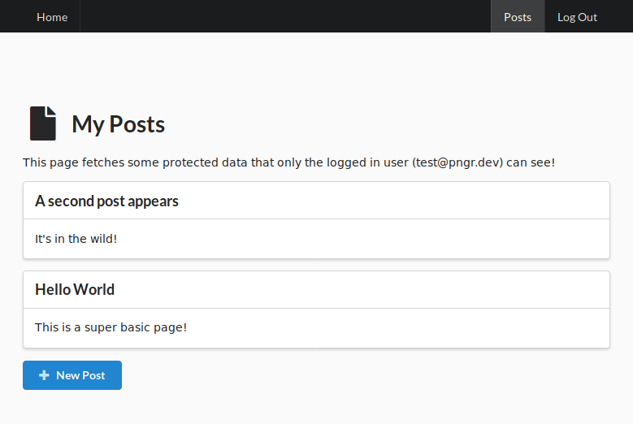

# PNGR Stack 🏓
[](https://github.com/karlkeefer/pngr/actions/workflows/build.yml)

Dockerized (postgres + nginx + golang + react) starter kit

Only implements `users`, `sessions`, `password_resets`, and a toy `post` type to demonstrate basic CRUD. PNGR is _not_ a CMS.

## Features and Stack

- Hot-reload, front and back, including a test-runner for golang changes

### Back-end
- [golang-migrate](https://github.com/golang-migrate/migrate) already configured for easy migrations
- [sqlc](https://github.com/kyleconroy/sqlc) for auto-generated sql bindings
- [gomock](https://github.com/golang/mock) for auto-generated mocks (also rigged with hot-reload!)
- [pgx](https://github.com/jackc/pgx) as a top tier db driver
- [golang-jwt](https://github.com/golang-jwt/jwt) cookies with automatic refresh: ready for horizontal scaling
- Simple [default middleware for CORS, CSRF, cookie parsing, etc](./golang/server/middleware.go).
- [httprouter](github.com/julienschmidt/httprouter) for [simple back-end routing](./golang/server/routes.go)

### Front-end
- [Vite](https://vitejs.dev/) dev server
- [Vitest](https://vitest.dev/) integration
- [React Router](https://github.com/ReactTraining/react-router) for [front-end routing](./react/src/Routes/Routes.js)
- [React Context](https://reactjs.org/docs/context.html) for global user state
- Functional-style typescript components throughout, including some helpful [custom hooks to simplify building forms](./react/src/Routes/Posts/PostForm.js)
- [Semantic UI React](https://react.semantic-ui.com/) for component library with functional [theme variables](https://github.com/Semantic-Org/Semantic-UI/blob/master/src/themes/default/globals/site.variables) and hot-reload

### Other goodies
- "Server-side rendering" with a [prerender sidecar container](./prerender/Dockerfile)
- A golang worker container stubbed out for async (non-API) tasks

Feature development is up to you!

## Requirements
Install `docker` && `docker-compose`

## Quick Start
```bash
# clone the repo
git clone https://github.com/karlkeefer/pngr.git my_project_name

# copy the .env template for your local version
cp .env.example .env

# build and start the containers
docker-compose up
```
1) Visit `http://localhost:4500`
2) Make changes to go, sql, or react code, and enjoy hot-reload goodness!



## Run client-side test watcher
```bash
docker-compose exec react npm run test
```

## Database Helpers

### Migrations
Migrations are created and run using simple wrappers around [go-migrate](https://github.com/golang-migrate/migrate).

```bash
# create files for a new migration
postgres/new my_migration_name

# execute any new migrations (this is also run automatically the container is created)
postgres/migrate up

# go down 1 migration
postgres/migrate down 1

# goto a migration by index
postgres/migrate goto 3
```

### Open a psql client
```bash
# remember to use \q to exit
postgres/psql
```

## Rebuild everything, including database(!), from scratch
Maybe your postgres went sideways from a wonky migration and it's easier to restart from scratch.
```bash
docker-compose down -v && docker-compose up --build --force-recreate
```

## Run in Production
*Warning: Run in production at your own risk!*

`docker-compose.prod.yml` is designed for a setup where postgresql is _not_ dockerized.

Don't forget to copy `.env.example` -> `.env` and setup your secrets/passwords for the new environment!
At minimum, you'll need to change `ENV`, `APP_ROOT`, and `TOKEN_SECRET`!

```bash
# build production images, and run them in a detached state
docker-compose -f docker-compose.prod-build.yml up --build -d
```

Note: using your production server as your build server is a bad idea, so you should consider using a registry...

### Using CI
You can modify the github action to push built containers to a container registry. The containers are tagged with the commit SHA by default.

You will also need to update `docker-compose.prod.yml` to point to your container registry.

```bash
# pull containers from a registry using a tag, then run them in a detached state
SHA=2c25e862e0f36e0fc17c1703e4f319f0d9d04520 docker-compose -f docker-compose.prod.yml up -d
```
